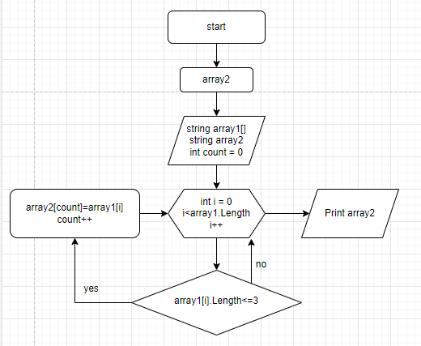

Задача: Написать программу, которая из имеющегося массива строк формирует новый массив из строк, длина которых меньше, либо равна 3 символам. Первоначальный массив можно ввести с клавиатуры, либо задать на старте выполнения алгоритма. При решении не рекомендуется пользоваться коллекциями, лучше обойтись исключительно массивами.

Примеры:
[“Hello”, “2”, “world”, “:-)”] → [“2”, “:-)”]
[“1234”, “1567”, “-2”, “computer science”] → [“-2”]
[“Russia”, “Denmark”, “Kazan”] → []

# Описание алгоритма решения:

1. В начале объявляется два массива: изначальный и вторый такой же длины. 
2. Потом объявляется метод, в котором цикл соразмерный длине массива
3. внутри цикла выполняется проверка условия ( <=3 ), если да элемент первого массива заносится в count элемент второго массива. 
4. Переменная count чтобы поочередно закидывать из первого массива во второй и чтобы потом не было пробелов. 
5. После присвоения увеличивается переменная count на 1 и возвращается к циклу for в котором i увеличивается на 1. И так проверяется до конца.